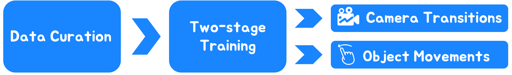

# Image Conductor
This repository is the official implementation of [Image Conductor](https://arxiv.org/pdf/2406.15339). It is a novel approach for precise and fine-grained control of camera transitions and object movements in interactive video synthesis.
<details><summary>Click for the full abstract of Image Conductor</summary>

> Filmmaking and animation production often require sophisticated techniques for coordinating camera transitions and object movements, typically involving labor-intensive real-world capturing. Despite advancements in generative AI for video creation, achieving precise control over motion for interactive video asset generation remains challenging. To this end, we propose Image Conductor, a method for precise control of camera transitions and object movements to generate video assets from a single image. An well-cultivated training strategy is proposed to separate distinct camera and object motion by camera LoRA weights and object LoRA weights. To further address cinematographic variations from ill-posed trajectories, we introduce a camera-free guidance technique during inference, enhancing object movements while eliminating camera transitions. Additionally, we develop a trajectory-oriented video motion data curation pipeline for training. 
</details>

**[Image Conductor: Precision Control for Interactive Video Synthesis](https://arxiv.org/pdf/2406.15339)** 
</br>
[Yaowei Li](https://scholar.google.com/citations?user=XlhADHoAAAAJ&hl=zh-CN),
[Xintao Wang](https://scholar.google.com.hk/citations?user=FQgZpQoAAAAJ&hl=en),
[Zhaoyang Zhang<sup>†</sup>](https://scholar.google.com.hk/citations?hl=en&user=Pf6o7uAAAAAJ),
[Zhouxia Wang](https://scholar.google.com.hk/citations?hl=en&user=JWds_bQAAAAJ),
[Ziyang Yuan](https://scholar.google.com.hk/citations?hl=en&user=fWxWEzsAAAAJ),
[Liangbin Xie](https://scholar.google.com.hk/citations?user=auQhf5EAAAAJ&hl=en&oi=ao),
[Ying Shan](https://scholar.google.com.hk/citations?user=4oXBp9UAAAAJ&hl=en&oi=ao),
[Yuexian Zou<sup>*</sup>](https://scholar.google.com.hk/citations?user=sfyr7zMAAAAJ&hl=en&oi=ao),
<sup>*</sup>Corresponding Author. <sup>†</sup>Project lead.


[](https://arxiv.org/pdf/2406.15339)
[](https://liyaowei-stu.github.io/project/ImageConductor/)
[](https://huggingface.co/spaces/TencentARC/ImageConductor) (Debugging, you can run it locally)

<!--  -->


**📖 Table of Contents**


- [Image Conductor](#image-conductor)
  - [📍 Todo](#-todo)
  - [🎨 Gallery](#-gallery)
  - [🧙 Method Overview](#-method-overview)
  - [🔧 Preparations](#-preparations)
    - [Setup repository and conda environment](#setup-repository-and-conda-environment)
    - [Prepare model weights](#prepare-model-weights)
  - [💫 Inference](#-inference)
    - [Run scripts](#run-scripts)
    - [Run local gradio demo](#run-local-gradio-demo)
  - [📣 Disclaimer](#-disclaimer)
  - [💞 Acknowledgements](#-acknowledgements)


## 📍 Todo
- [x] Release ImageConductor v1 checkpoints
- [x] Release Gradio demo
- [x] Release the ImageConductor code
- [x] Release paper

## 🎨 Gallery
We show more results in the [Project Page](https://liyaowei-stu.github.io/project/ImageConductor/).

## 🧙 Method Overview
<div align="center">
    
</div>
To address the lack of large-scale annotated video data, we first design a data construction pipeline to create a consistent video dataset with appropriate motion. Then, an well-cultivated two-stage training scheme is proposed to derive motion-controllable video ControlNet, which can separate camera tansitions and object movements based on distinct lora weights.


## 🔧 Preparations
### Setup repository and conda environment
Adjust the PyTorch version according to the CUDA version you are using. CUDA 12.1 for our case.
```
git clone https://github.com/liyaowei-stu/ImageConductor.git
cd ImageConductor

conda create -n imageconductor python=3.10 -y
conda activate imageconductor
pip install -r requirements.txt
```
### Prepare model weights
- Download the weights of Stable-Diffusion v1.5 [SDv1.5](https://huggingface.co/runwayml/stable-diffusion-v1-5) and put it to `./models`.
- Download the weights of ImageConductor [imageconductor_v1](https://huggingface.co/TencentARC/ImageConductor) and put it to `./models`.
- (optional) Manually download the community .safetensors models from [CivitAI](https://civitai.com), and save them to models/personalized.
The model structure should be like:
```
|-- models
    |-- stable-diffusion-v1-5
        |-- model_index.json
        |-- vae
        |-- text_encoder
        |-- ...
    |-- unet.ckpt
    |-- image_controlnet.ckpt
    |-- flow_controlnet.ckpt
    |-- personalized
        |-- helloobjects_V12c.safetensors
        |-- TUSUN.safetensors
        |-- ...
```


## 💫 Inference
### Run scripts
- Running scripts:

        sh scripts/inference.sh
### Run local gradio demo
- Running scripts:
  
        sh scripts/app.sh

## 📣 Disclaimer
This is official code of Image Conductor.
All the copyrights of the demo images and audio are from community users. 
Feel free to contact us if you would like remove them.

## 💞 Acknowledgements
The code is built upon the below repositories, we thank all the contributors for open-sourcing.
* [AnimateDiff](https://github.com/guoyww/AnimateDiff)